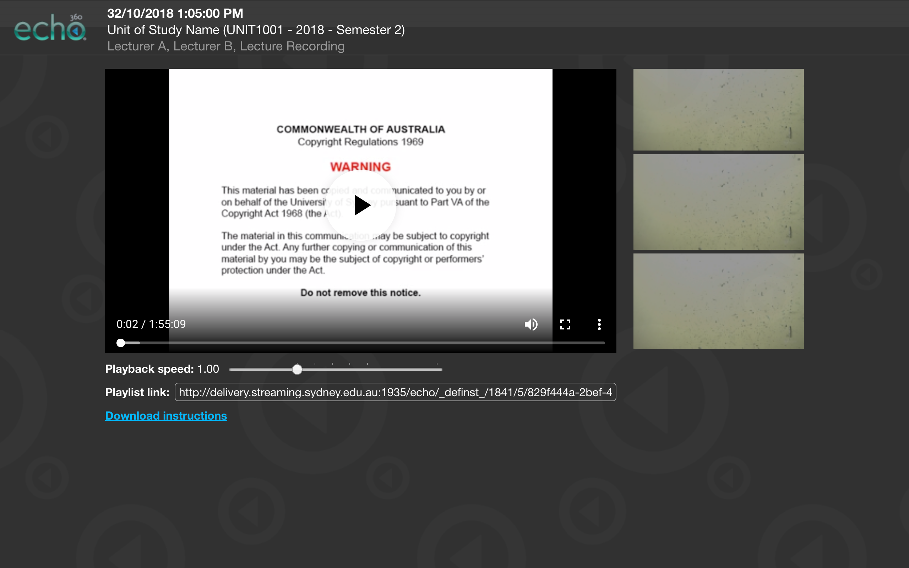

# Echo360 Loader
**A Chrome extension to load USYD Echo360 videos without Flash.**  
Includes playback speed controls and thumbnail seeking.

Get it on the [**Chrome Web Store →**](https://chrome.google.com/webstore/detail/hekcgkbebmbmbclcgikaocemhaeafpbf/)
or as a
[.crx](https://github.com/notseenee/echo360loader/releases)

[**Instructions to download the video using ffmpeg →**](downloadinstructions.md)

## Safari extension

This is a port of the Chrome extension with a few changes made.  
I will not be releasing this on the Safari Extension Gallery or Mac App Store
due to Apple’s 99 USD/year developer fee.

[**Installation instructions →**](echo360loader.safariextension)

## Under the hood
This extension redirects the browser from the default (horrible) Flash player to
the iPad version of the player. It then uses hls.js to play the HLS stream in
the Chrome video player.

- `background.js` enables the toolbar icon on `delivery.streaming.sydney.edu.au`
  pages
- `redirect.js` redirects `view.streaming.sydney.edu.au` pages to the iPad
  player at
  `http://delivery.streaming.edu.au/echo/templates/.../echo_files/echo_ipad.htm`
- `hls.js` is the bundled hls.js
- `contentScript.js` plays the HLS stream, adds custom controls below the video,
  re-adds the metadata on the top of the page, and fixes thumbnail seeking
- `popup.js` displays the extension’s version number in the popup

### HTTPS issues
This extension uses the non-HTTPS version of the iPad player since the HLS
stream is not served with HTTPS, so could not be loaded in Chrome without the
user enabling mixed content every time they watch a video.

This also means the metadata on the top of the player page was broken, since it
gets data from a HTTPS iframe on the page, which Chrome blocks if the main page
is HTTP. `contentScript.js` fixes this. 

## Extending this extension
This extension is limited to USYD’s implementation of Echo360. If you want to
extend this extension to your own university’s Echo360 system, replace the
`streaming.sydney.edu.au` host names on the following files with the corresponding
host names:
- [`manifest.json`](src/manifest.json) lines 10 and 14
- [`background.js`](src/background.js) line 5

## Version history
| Version | Changes                                                            |
| -------:|:------------------------------------------------------------------ |
|   1.3.1 | Remove old unnecessary XHR request in `contentScripts.js`          `
|   1.3.0 | Fix Windows Chrome always going to ios_error.htm                   |
|   1.2.1 | More UI fixes for Windows                                          |
|   1.2.0 | UI fixes for Windows, show popup when ios_error.htm is shown       |
|   1.1.0 | Clean up code and add README.md                                    |
|   1.0.0 | Initial release to the Chrome Web Store                            |

## Copyright and licensing
This extension and its source code is released under the [MIT Licence](LICENSE).

This extension bundles [hls.js](https://github.com/video-dev/hls.js/), which is
licensed under Apache Licence 2.0. Its copyright notice is preserved
[here](LICENSE).
